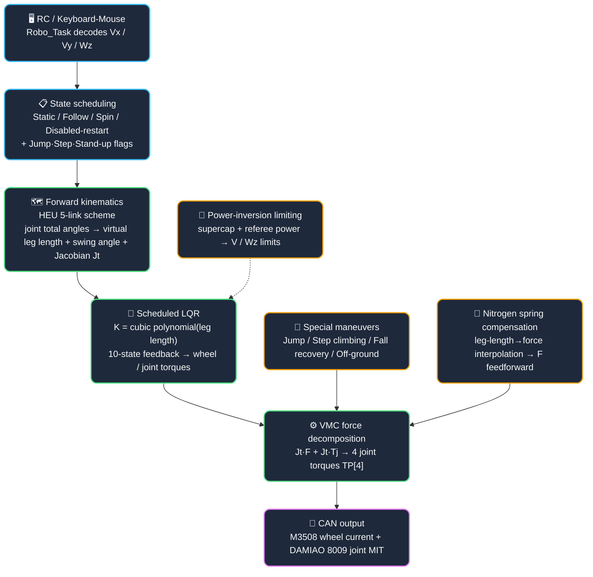

# Serial-Leg Balancing Wheel-Legged Robot

**English** | [简体中文](README.md)

[](https://www.st.com/en/microcontrollers-microprocessors/stm32g474ve.html)
[]()
[]()
[]()
[]()
[](./LICENSE)

> Motion-control firmware for a **serial-leg balancing wheel-legged robot**: the RC transmitter / keyboard-mouse only sends `Vx / Vy / Wz` plus leg-length / leg-swing-angle targets; this firmware runs a **1 ms closed-loop chain of HEU forward kinematics → leg-length-scheduled LQR → VMC (virtual model control) → Jacobian force decomposition** to solve and execute motion, with built-in special maneuvers such as **jumping, automatic step climbing, self-recovery from a fall, and off-ground detection**. Four independent joint motors dynamically adjust leg length to achieve active suspension and obstacle-crossing maneuvers.

---

## ⚙️ Core Features (10 Motion-Control Highlights)

1. **Nitrogen spring dynamic compensation** — The serial leg houses a nitrogen spring whose return force rises **non-linearly with leg length** (90–100 N at 0.14 m, 159–180 N at 0.38 m; the left and right legs use separate calibration tables `spring_table_L/R` due to mechanical differences). `GasSpring_GetForce()` **piecewise-linearly interpolates** the spring thrust for the current leg length, clamps it at a `200 N` safety limit, and injects it as a **dynamic feedforward** `Spring_comp` into the leg-length force loop `F_L/F_R`. Effect: it turns the nonlinear, hard-to-converge leg-length PID into control of a **pure inertial plant** — the leg extends and retracts precisely at constant speed, which is the prerequisite for smooth execution of every leg-length action (jumping / step climbing / stand-up).
2. **Scheduled LQR** — The wheel-leg symbiotic system is highly dynamic with a wide leg-length range (0.15–0.35 m), so fixed gains cannot cover all operating points. Solution: each of the 12 LQR gains is fitted offline against the average leg length with a **cubic polynomial** `K = a·len³ + b·len² + c·len + d` (`Poly_Coefficient[12][4]`), and `calucateK()` interpolates the live gains `LQR_K[12]` every 1 ms. The 10-dimensional state vector: left/right leg swing angle / angular velocity / angular acceleration (differential estimate) + wheel displacement / velocity + body pitch / pitch rate; `calucateLQR_L/R()` solves the left and right wheel torques and the leg swing-joint torque separately.
3. **VMC virtual model control** — The upper layer produces two physically intuitive virtual quantities, **leg force `F_L/F_R` and leg swing-joint torque `Torque_Joint`**, which the force Jacobian matrices `Jt_l/Jt_r` map uniformly onto the 4 joint-motor torques `TP[4]` (`calucateTp()`). Forward kinematics uses the **HEU 5-link scheme**, solving the virtual leg length / swing angle and `Jt` from the four joint-motor total angles. Complemented by `Gravity_Comp=90 N` gravity feedforward, `Roll_Leg_PID` roll left-right differential control, and `Tp_Comp_PID` to keep the two legs' swing angles summing to zero (anti-splitting).
4. **Jump algorithm (4 states + 3 levels)** — `Jump_Level` 1/2/3 corresponds to push-off leg lengths of 0.20/0.25/0.33 m; jump strength can be switched at any time from the RC / keyboard-mouse. State machine: **state 0 crouch for energy storage** (retract the legs to compress the spring; both legs < 0.16 m accumulate for 30 ticks) → **state 1 ramped push-off** (`F = Spring_comp + K_slope·330 N`, `K_slope += 25·dt` ramps the force to avoid catapult jitter) → **state 2 airborne leg retraction** (dedicated retraction PID amplified, joints keep only swing-angle LQR ×0.25 to lock attitude, **wheel motors driven to 0**; a 40-tick transition threshold sets the airborne retraction duration: 50 = long hang time / 30 = short hang time) → **state 3 landing and reset**. In the air the two legs' swing angles are held independently by LQR to prevent splitting.
5. **Automatic step climbing** — When `Up_Step_Dection()` detects an entry it extends the legs to the maximum 0.35 m and **releases the leg-length speed limit** (`V_limit` fixed at 2.3 instead of decreasing with leg length), so the robot can accelerate within a short distance to strike the step; when **both legs' swing angles > 14° and their angular velocities > 1.7**, the step is judged as hit and `UpStep_Flag` is set. In `Up_Step_Func()` state 0, **both legs swing back ±55° while retracting** (target leg length 0.15 m, retract to < 0.18 m, wheels driven to 0 to prevent creeping); once both legs are in position for 25 accumulated ticks → state 2 restores regular control and clears the flag.
6. **Off-ground detection (support-force dynamics estimation)** — Instead of adding force sensors, `Off_ground_Detection()` estimates each wheel-end support force from the dynamics equation `Fn = M_wheel·g + P`, where `P = (Gravity_Comp + leg-length velocity-loop output)·cosθ + Torque_Joint·sinθ/L0` is the equivalent axial force the leg applies at the wheel end. `Fn < 50 N` marks that wheel as off the ground, and **both wheels off the ground AND body Z-axis acceleration < -5** are required to set `Off_ground_Flag` (both criteria guard against false positives). Once triggered: wheel-motor torques are set to 0 (no spinning in the air), leg-length control switches to a **soft-landing constant force** `Soft_landing_Comp_F = 120 N`, and the joints keep only swing-angle LQR, achieving a smooth landing buffer. Masked during jumping / step climbing, and not checked before stand-up.
7. **Self-recovery from a fall + soft stand-up** — `Recover_from_Ground()` uses the sign of pitch to decide **nose-down / tail-down fall**, state machine: **state 0 level the legs and swing them forward** (wheels at 0, swing-angle velocity loop centers to find a horizontal pose) → **state 2 retract to the minimum 0.15 m** (< 0.17 m for 200 accumulated ticks) → **state 3** return to `Chassis_STATIC` + `Allow_to_Stand=1`. `Smooth_Restand_Func()` **soft stand-up**: from a fallen state it first **slowly retracts the legs** (only nitrogen-spring compensation + leg-length PID, < 0.17 m for 100 accumulated ticks) and only enters regular control once gated by `Allow_to_Stand_Flag`, preventing a high-speed leg extension runaway right after power-on.
8. **Kalman velocity observer** — Each wheel has a 2-state Kalman filter (`xvEstimateKF`) that uses the **encoder velocity** as the measurement and the **IMU acceleration** as the input to fuse a stable vehicle speed `V_ave` for the LQR displacement/velocity states, significantly suppressing speed spikes caused by wheel slip or encoder jumps.
9. **Power-inversion limiting + leg-length speed limiting** — Power guard: `Chassis_Power_MAX = live supercapacitor power + referee power limit`; a linear model inverts the maximum deliverable `V_limit / Wz_limit`, so the robot actively reduces speed to stay within the power budget when power is scarce. Stability guard: `V_limit` (2.3 → 1.3 m/s linearly as leg length goes 0.22 → 0.36 m) and `Wz_limit` decrease with leg length — the higher the body, the more divergent the system, so it is limited; the step-climbing state specifically releases the V limit to hit the step at speed.
10. **SPIN translation decoupling** — In SPIN mode, Vx/Vy are **rotated and decomposed** by the gimbal yaw angle (`arm_sin_f32` phase allocation, `-45°` phase compensation `offset_Comp`) and summed into chassis translation, covering all four quadrants × both rotation directions, so the chassis keeps strafing around the enemy while the gimbal holds the target. The spin rate scales with `Chassis_Speed_Level` over 5 levels (6/7.5/8.5/10/12 rad/s); entering the mode is gated by `|vehicle speed| < 2.2` to prevent a rollover when engaging at speed.

---

## 🧭 Technical Route

**The upper layer only sends velocity / leg-length targets; everything else — motion solving and maneuvers — is handled by the chassis motion controller**:



**Route essence**: no global inverse kinematics / whole-body planner is relied upon — the upper layer only gives velocity and leg-length targets, and the chassis closes the loop from forward kinematics + scheduled LQR + VMC to torque output within 1 ms; **special maneuvers (jump / step / stand-up) are superimposed as state machines at the force / torque level**, sharing the same Jacobian decomposition chain with regular control.

---

## 🚀 Quick Start

> ⚠ **"Zero calibration + soft stand-up" at power-on is the top pitfall**: joint motors use absolute magnetic encoders, so zero calibration (`If_SettingZero`) is mandatory at power-on, followed by a 100 ms delay to prevent the robot from going wild right after calibration; after a fall or a disabled state, a new power-on must go through `Smooth_Restand_Func` to **retract the legs slowly**, and only enters regular control after `Allow_to_Stand_Flag` is ready — otherwise the leg-length force loop jumps instantly.

### 🖥️ Build & Flash

```bash
# ① Open the project with Keil MDK-ARM
#    MDK-ARM/Kawashiro_Frame_G474.uvprojx

# ② Build (F7) → artifacts are placed under MDK-ARM/

# ③ Connect a J-Link / DAP-Link debugger → flash (F8)
```

### 🔧 Hardware Configuration (when changing pins)

```bash
# ① Open Kawashiro_Frame_G474.ioc with STM32CubeMX
# ② Change pins / peripherals → Generate Code
# ③ Code between /* USER CODE BEGIN/END */ is preserved
```

### 🧪 Debug: VOFA Waveforms

```bash
# ① USB CDC enumerates as a virtual COM port
# ② Pick that port in VOFA+ with the JustFloat protocol
# ③ Inspect float waveforms (motor speed / current / attitude angles, etc.)
```

> 📖 **Full from-scratch build / software dependencies / real-robot reproduction / troubleshooting: see [docs/依赖编译指南.md](docs/依赖编译指南.md) (in Chinese)**; for the complete chassis control data flow / parameter calibration, see [docs/PROJECT_DATASHEET.md](docs/PROJECT_DATASHEET.md) (in Chinese).

---

## 🔌 Environment & Hardware

### Environment

| Item | Configuration |
|------|---------------|
| IDE / Toolchain | Keil MDK-ARM 5.x (ARM Compiler 5/6, AC6 recommended) |
| Configuration tool | STM32CubeMX (used when changing pins) |
| Debugger | J-Link / DAP-Link / ST-Link |
| Host tool | VOFA+ (JustFloat float visualization) |
| RTOS | FreeRTOS V10.3.1 (CMSIS RTOS v1 wrapper) |
| CMSIS-DSP | arm_math.h (trigonometry for forward kinematics / rotation decomposition) |

### Robot Hardware

| Component | Model | Description |
|-----------|-------|-------------|
| MCU | STM32G474VETx | Cortex-M4F / 170 MHz / FPU + DSP |
| Joint motors ×4 | DAMIAO 8009 | Serial-leg hip joints, MIT control (FDCAN1) |
| Wheel motors ×2 | DJI M3508 | Chassis drive wheels, 250 Hz torque control (FDCAN2) |
| Attitude | Bosch BMI088 | SPI, 6-axis IMU → quaternion EKF |
| Power | Supercapacitor | FDCAN1, power-inversion limiting (CAN ID 0x030/0x031) |
| Remote | DJI DR16 | USART1 SBUS + RS485 (USART2/3) |
| System | FreeRTOS | Robo_Task (Realtime) + Chassis_Task (High), 1 ms dual-task scheduling |

---

## 📂 Project Structure

```text
Balanced_WheelLeg_Robot/
├── Project/
│   ├── Robot_Application/        # Robot core logic ⭐
│   │   ├── Chassis.c/.h          # Chassis motion control: scheduled LQR / VMC / jump / step / off-ground / stand-up / nitrogen spring ⭐
│   │   ├── RoboControl.c/.h      # Input→state scheduling, feature-flag triggering, disable/restart ⭐
│   │   ├── Communicate.c/.h      # Dual-board communication protocol (uplink / downlink / remote frames)
│   │   ├── Gimbal.c / INS.c      # Gimbal control / inertial attitude estimation
│   │   ├── Shoot.c / Aim.c       # Shooter control / auto-aim data handling (peripheral support)
│   │   └── Define.h              # Global macros: CAN IDs, motor parameters, pin mapping
│   ├── Algorithm_Drivers/        # PID / kalman / QuaternionEKF / Power_Limit / Vofa
│   ├── BSP/                      # BMI088 / DWT / Buzzer / Key / LED / PWM / Flash
│   ├── Hardware_Drivers/         # Motor_DJI / Unitree / DAMIAO, Remote_Control, Referee_Unpack, SuperCap
│   ├── Commnuicate_Drivers/      # CAN_FDCAN / USART / USB CDC
│   └── UI/  UI-backup/  Vision_Old/      # Referee UI drawing / legacy vision (peripheral)
├── Core/                                 # CubeMX-generated HAL / FreeRTOS config / interrupts
├── Drivers / Middlewares / USB_Device/   # STM32 HAL + FreeRTOS + USB official libraries
├── MDK-ARM/Kawashiro_Frame_G474.uvprojx  # Keil project file
├── README.md                             # Chinese README
└── README.en.md                          # English README (this file)
```

---

## 🗂️ System Architecture & Modules

Chassis motion control is single-board embedded firmware: **one Chassis_Task 500 Hz control loop + one Robo_Task state scheduler**, with no multi-machine distributed modules. Core module responsibilities:

| Module | Responsibility |
|--------|----------------|
| `Chassis_Task` | 500 Hz motion control: forward kinematics → scheduled LQR → VMC decomposition → special-maneuver superposition → torque output |
| `Robo_Task` | RC / keyboard-mouse decoding → chassis state + Vx/Vy/Wz + feature flags; disable / restart / gear switching |
| `Communicate` | Dual-board protocol: gimbal board → chassis (yaw error + shoot flags), chassis → gimbal board (odometry + fall-recovery flag) |
| `INS` | BMI088 6-axis + quaternion EKF, outputs pitch / roll / yaw |
| `Power_Limit` | Combined referee-power + supercapacitor-power limiting |
| `Motor_*_Driver` | Unified motor management for M3508 current / DAMIAO MIT / M2006 friction-wheel |

**Control-chain essence**: all special maneuvers (jump / step / stand-up / off-ground) are injected as "force or joint-torque superpositions" into the same `calucateTp()` Jacobian decomposition point, **sharing a single torque-composition stage** with the regular LQR output — a maneuver only changes where the values of `F_L/F_R` and `Torque_Joint` come from, it does not start a separate control loop.

---

## 📡 Communication Interfaces (Summary)

Frame structures are defined in `Communicate.h` (`__packed` bitfield packing):

| Direction | Frame | Type | Description |
|-----------|-------|------|-------------|
| Uplink (gimbal board → chassis) | Attitude packet | `Double_Board_Up_to_Down_TypedefStruct` | `Yaw_Errx100` + `Gimbal_Yaw_TotalAnglex100` + 8 bitfields (shutter / gimbal / friction-wheel level) + Pitch / offset |
| Downlink (chassis → gimbal board) | Status packet | `Double_Board_Down_to_UP_TypedefStruct` | `Recover_from_ground_Flag` + chassis odometry `Vxx100/Vyx100` + heat cooldown |
| Uplink (referee) | Referee packet | `Double_Board_Down_to_UP_Referee_TypedefStruct` | `Shoot_Qmax/Qnow` + `robot_id` + `initial_speedx100` |
| Remote | Joystick packet | `Remote_Pack1_TypedefStruct` | Dual joysticks + switch Mode, custom button bitfields |
| Remote | Keyboard-mouse packet | `Remote_Pack2_TypedefStruct` | Mouse + WASDQE / Shift / Ctrl / R / F custom function-key bitfields |

**Chassis bus contract**:

| Bus | Peripheral / Device | Purpose |
|-----|---------------------|---------|
| FDCAN1 | Joint motors (DAMIAO) + supercapacitor | Leg-length MIT force control / power |
| FDCAN2 | Wheel motors (M3508) + gimbal Pitch | 250 Hz torque control |
| FDCAN3 | Gimbal Yaw + friction wheels + trigger + external IMU | Gimbal / shooter |
| SPI4 | BMI088 | 6-axis attitude |
| USART1 | SBUS | RC transmitter |
| USB CDC | VOFA+ | Float debug waveforms |

---

## 🐛 Troubleshooting (Top)

| Symptom | Root cause / handling |
|---------|-----------------------|
| Joints run away / jump when enabled | **Missing zero calibration or incomplete soft stand-up**: run `If_SettingZero` first and wait 100 ms; after a fall, go through `Smooth_Restand_Func` and only enter control when `Allow_to_Stand_Flag=1` |
| Control diverges / cannot track at speed | **Leg-length speed-limit boundary**: `V_limit` decreases linearly with average leg length; check whether `Ave_Leg_Length` > 0.22 m falsely triggers the limit |
| Wheels spin out of control / power overrun | **Wheel overspeed ungoverned**: `Limit_Left/Right_Wheel_RPM_PID` overspeed compensation (currently soft-disabled by default — check whether it is enabled); verify the supercapacitor power-inversion limiter is active |
| Unstable jump landing | **Airborne retraction duration parameter**: the transition threshold (40 ticks) of `Jump_State==2` decides when to start extending for the landing buffer, 50 = long hang / 30 = short hang |
| Step-climbing detection fails | **Impact double-threshold slightly off**: tune `angle_error_gate=14°` / `angle_dot_error_gate=1.7` to the actual joint softness reflected by the current LQR |
| Off-ground false / missed detection | **Support-force threshold and filtering**: `Detect_Force=50 N` needs body-mass calibration; Z-axis acceleration passes a 3-point median + low-pass cascade, and `MotionAccel_n_Z<-5` is the double criterion against false positives |
| No active leg lowering when tipping | **Tip-over warning not enabled**: `Simple_TipOver_Detection()` is currently commented out pending tests (2-of-3 conditions → `Warning_Flag` → active leg lowering for stability); enable and calibrate thresholds manually |

---

## 📖 Documentation

| Document | Content |
|----------|---------|
| [docs/依赖编译指南.md](docs/依赖编译指南.md) | ⭐ **From-scratch build & deployment (in Chinese)**: toolchain / software dependencies / build & flash / real-robot reproduction / troubleshooting |
| [docs/PROJECT_DATASHEET.md](docs/PROJECT_DATASHEET.md) | ⭐ **Engineering datasheet (single source of truth, in Chinese)**: core configuration / algorithm flow / quantitative results / design decisions / highlights / known limitations |
| [README.md](README.md) | Chinese version of this README |
| [LICENSE](LICENSE) | Apache-2.0 license |

> ℹ The Chinese and English READMEs are kept in sync; where they diverge, the Chinese version prevails. The `docs/` deep documents are currently Chinese-only.

---

## 📄 License

The code and documentation in this repository are released under **Apache-2.0** (see [LICENSE](LICENSE)). Copyrights of the bundled third-party libraries belong to their respective owners, and their original licenses are kept alongside the corresponding directories:

| Component | Location | License |
|-----------|----------|---------|
| FreeRTOS V10.3.1 | `Middlewares/Third_Party/FreeRTOS` | MIT |
| STM32G4xx HAL drivers + USB library | `Drivers/`, `Middlewares/ST` | BSD-3-Clause |
| CMSIS (core + G4 device) | `Drivers/CMSIS` | Apache-2.0 |
| Chassis/control reference implementations (Wang Hongxi et al.) | Reference chassis control system design | See acknowledgements below; attribution must be retained |

> ⚠ `arm_math.h` (CMSIS-DSP) is **not** distributed with this repository; install `ARM.CMSIS-DSP` via the Keil Pack Installer before building — see [docs/依赖编译指南.md](docs/依赖编译指南.md).
> Apache-2.0 covers only the code developed in this project; attribution and usage of referenced third-party solutions (e.g. balanced-infantry chassis control) are listed in **Acknowledgements**, respecting their original licenses.

---

## 🙏 Acknowledgements

This project is built upon the following excellent open-source projects / reference implementations:

- [Balanced Infantry Control System (Wang Hongxi)](https://github.com/) — chassis control algorithm scheme / Kalman filter / quaternion EKF / controller foundation
- [XJTLU WUST_MURRAY Power Limit](https://github.com/) — referee-system-based power limiting algorithm
- [DJI Referee System Protocol (DJI 2019)](https://github.com/) — CRC8/CRC16 checksums and data unpacking
- [FreeRTOS](https://www.freertos.org/) — real-time task scheduling kernel
- [Bosch BMI088](https://www.bosch-sensortec.com/) — 6-axis IMU driver adaptation

---
