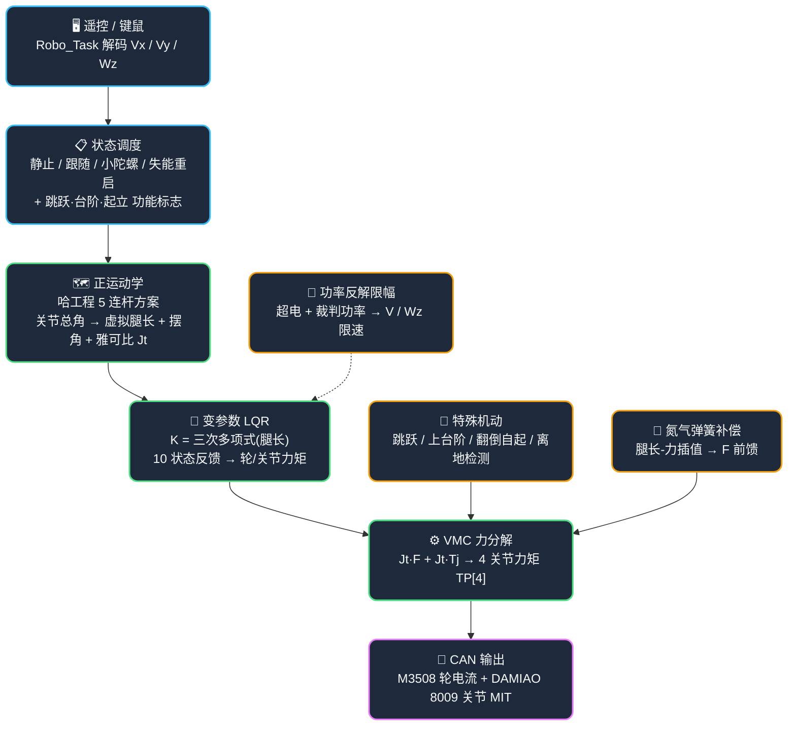

# 串联腿构型平衡轮腿机器人

[](https://www.st.com/en/microcontrollers-microprocessors/stm32g474ve.html)
[]()
[]()
[]()
[]()
[](./LICENSE)

> **串联腿构型平衡轮腿机器人**的运动控制固件工程：遥控器 / 键鼠只需下发 `Vx / Vy / Wz` 与腿长 / 腿摆角目标，本工程经**哈工程正运动学 → 变参数 LQR → VMC 虚拟模型控制 → 雅可比力分解**的 1ms 闭环链路完成运动解算与执行，并内建**跳跃、自动上台阶、翻倒自起、离地检测**等特殊机动动作。通过四条独立驱动关节电机动态调节腿长，实现主动悬挂与越障机动。

> 🚨 **与参考项目「整体集成控制架构」的核心区别**：本仓库**重心在底盘运控**，不在云台 / 发射 / 自瞄等整体集成结构——外围模块仅作为底盘运控的支撑存在。底盘运控重**单个 bsp / 状态机的深入设计**，不重多模块抽象分层。读代码 / 文档时请聚焦 `Chassis.c` 与 `RoboControl.c`。

---

## 🔖 最近里程碑

- **【待补充：日期】** 氮气弹簧动态补偿落地 —— 腿长-力映射表分段线性插值作动态前馈，抵消弹簧非线性，腿长力控等效为纯惯性对象。
- **【待补充：日期】** 变参数 LQR 上车 —— 12 个 LQR 增益以三次多项式拟合腿长，腿高变化时增益实时插值，兼顾 0.15~0.35m 全工作点。
- **【待补充：日期】** 跳跃算法 3 档 / 4 态状态机 —— 降腿蓄力 → 斜坡蹬腿 → 空中收腿 → 落地缓冲，空中轮电机置 0。
- **【待补充：日期】** 自动上台阶 + 翻倒自起 —— 磕碰双阈值检测 → 后摆收腿踏阶；前栽/后仰判定 → 状态机起立。

> 以上为当前代码库已确认实现的底盘能力，具体验收日期与实测数据**待补充**。

---

## ⚙️ 核心功能（10 大运控创新点）

1. **氮气弹簧动态补偿** — 串联腿内置氮气弹簧，其回复力随腿长**非线性上升**（腿长 0.14m 时 90~100N，0.38m 时 159~180N，左右腿因机械差异各一张独立标定表 `spring_table_L/R`）。`GasSpring_GetForce()` 按当前腿长在映射表内**分段线性插值**出弹簧推力，`200N` 安全限幅后作为**动态前馈** `Spring_comp` 注入腿长力控 `F_L/F_R`。作用：把被弹簧非线性干扰、难以收敛的腿长 PID 变成对**纯惯性对象**的控制，腿长可精确匀速伸缩，是跳跃/上台阶/起立一切腿长动作平稳执行的前提。
2. **变参数 LQR** — 轮腿共生系统高动态、腿长跨度大（0.15~0.35m），固定增益无法兼顾全工作点。方案：12 个 LQR 增益各自用一个**三次多项式** `K=a·len³+b·len²+c·len+d` 对平均腿长离线拟合（`Poly_Coefficient[12][4]`），1ms 周期由 `calucateK()` 实时插值出 `LQR_K[12]`。状态量 10 维：左右腿摆角/角速度/角加速度（差分估计）+ 车轮位移/速度 + 机体 pitch/角速度，`calucateLQR_L/R()` 分别解左、右轮力矩与关节摆角力矩。
3. **VMC 虚拟模型控制** — 上层控制产出**腿力 `F_L/F_R` + 关节摆角力矩 `Torque_Joint`** 两组物理直观的虚拟量，再经力雅可比方阵 `Jt_l/Jt_r` 统一映射为 4 个关节电机力矩 `TP[4]`（`calucateTp()`）。正运动学采用**哈工程 5 连杆方案**，由 4 个关节电机总角解出虚拟腿长/腿摆角与 `Jt`。配 `Gravity_Comp=90N` 重力前馈、`Roll_Leg_PID` 横滚左右差动、`Tp_Comp_PID` 两腿摆角和归零防劈叉。
4. **跳跃算法（4 态 + 3 档）** — `Jump_Level` 1/2/3 对应蹬伸腿长 0.20/0.25/0.33m，遥控/键鼠随时切换跳跃强度。状态机：**态0 降腿蓄力**（收腿压缩弹簧储能，双腿 <0.16m 累计 30tick）→ **态1 斜坡蹬腿起跳**（`F = Spring_comp + K_slope·330N`，`K_slope += 25·dt` 斜坡缓加力防弹射抖动）→ **态2 空中收腿**（收腿专用 PID 放大、关节只留摆角 LQR×0.25 锁姿态、**轮电机置 0**，转移阈值 40tick 决定滞空收腿时长：50=长滞空/30=短滞空）→ **态3 落回复位**。空中左右腿摆角独立 LQR 维持防劈叉。
5. **自动上台阶** — `Up_Step_Dection()` 进入检测即把腿伸至最高 0.35m 并**解除腿长限速**（`V_limit` 固定 2.3 不再随腿长递减），使短距内能加速磕上台阶；当**双腿摆角均 >14° 且 角速度均 >1.7** 时判「磕到台阶」触发 `UpStep_Flag`。`Up_Step_Func()` 态0 **后摆腿 ±55° 同时收腿**（目标腿长 0.15m、收至 <0.18m，轮置 0 防窜），双腿到位累计 25tick → 态2 复位常规并清标志。
6. **离地检测（支持力动力学估算）** — 不舍弃力传感器，`Off_ground_Detection()` 用动力学方程估算每轮端支持力 `Fn = M_wheel·g + P`，其中 `P = (Gravity_Comp + 腿长速度环输出)·cosθ + Torque_Joint·sinθ/L0` 为腿作用于轮端的等效轴向力。`Fn < 50N` 判该轮离地，**双腿同时离地 且 机体 Z 轴加速度 < -5** 双重条件才置 `Off_ground_Flag`（两个判据都防误判）。触发后：轮电机力矩置 0（避免空中乱转）、腿长控制切**软着陆恒力** `Soft_landing_Comp_F=120N`、关节只保摆角 LQR，实现平稳落地缓冲。跳跃/上台阶期屏蔽、起立前不检测。
7. **翻倒自起 + 缓起立** — `Recover_from_Ground()` 按 pitch 正负判**前栽/后仰**，状态机：**态0 平齐双腿并前摆**（轮置 0、摆角速度环归中找水平位形）→ **态2 收腿至最短 0.15m**（<0.17m 累计 200tick）→ **态3** 恢复 `Chassis_STATIC` + `Allow_to_Stand=1`。`Smooth_Restand_Func()` **缓起立**：倒地态先**缓慢收腿**（只加氮气弹簧补偿 + 腿长 PID，<0.17m 累计 100tick）经 `Allow_to_Stand_Flag` 门控才进常规运控，防一上电高速伸腿疯车。
8. **卡尔曼速度观测器** — 左右轮各 1 个 2 维卡尔曼（`xvEstimateKF`），以**编码器速度**为测量、**IMU 加速度**为输入，融合出稳定车速 `V_ave` 供 LQR 位移/速度状态使用，显著抑制轮子打滑、编码器跳变引起的速度突变。
9. **功率反解限幅 + 腿长限速** — 功率守护：`Chassis_Power_MAX = 超电实时功率 + 裁判功率上限`，按线性模型反解能输出的极限 `V_limit / Wz_limit`，抢电时主动压速度保功率。稳定守护：`V_limit`（2.3→1.3 m/s 随腿长 0.22→0.36m 线性递减）、`Wz_limit` 随腿长同降——腿越高机体越易发散越限速；上台阶态专门解除 V 限速以高速磕阶。
10. **小陀螺平移解耦（SPIN）** — SPIN 态下 Vx/Vy 按云台 yaw 角**旋转分解**（`arm_sin_f32` 相位分配、`-45°` 相位补偿 `offset_Comp`），叠加成底盘平移，四象限 × 正反转全组合覆盖，实现绕敌平移时云台持续锁敌。转速随 `Chassis_Speed_Level` 5 档缩放（6/7.5/8.5/10/12 rad/s），入态受 `|车速| < 2.2` 门控防高速切入翻车。

---

## 🧭 技术路线

**上层只需下发速度 / 腿长目标，其余运动解算与机动动作全部由底盘运控完成**：



**路线本质**：不依赖全局逆运动学 / 整体规划器——上层只给速度与腿长目标，底盘经正运动学 + 变参数 LQR + VMC 在 1ms 内闭环到力矩输出；跳跃 / 台阶 / 起立等**特殊机动以状态机叠加到力 / 力矩端**，与常规运控共用同一雅可比分解链路。

---

## 🚀 快速开始

> ⚠ **上电「设零点 + 缓起立」是首要坑**：关节电机为绝对磁编码，上电必须先设零点（`If_SettingZero`）并延时 100ms 防设零后直接进运控疯车；倒地/失能再上电须走 `Smooth_Restand_Func` **缓收腿**且 `Allow_to_Stand_Flag` 就绪后才进入常规运控，否则一使能腿长力控突跳。

### 🖥️ 编译烧录

```bash
# ① 用 Keil MDK-ARM 打开工程
#    MDK-ARM/Kawashiro_Frame_G474.uvprojx

# ② 编译（F7）→ 产物位于 MDK-ARM/

# ③ 连线调试器 J-Link / DAP-Link → 烧录（F8）
```

### 🔧 硬件配置修改（改引脚时）

```bash
# ① 用 STM32CubeMX 打开 Kawashiro_Frame_G474.ioc
# ② 改引脚 / 外设配置 → Generate Code 重新生成
# ③ /* USER CODE BEGIN/END */ 之间代码会被保留
```

### 🧪 调试：VOFA 波形

```bash
# ① USB CDC 枚举为虚拟串口
# ② 上位机 VOFA+ 选对应串口，JustFloat 协议
# ③ 查看电机速度 / 电流 / 姿态角等浮点波形
```

> 📖 **从零构建 / 软件包依赖 / 真机复现 / 排坑全流程见 [docs/依赖编译指南.md](docs/依赖编译指南.md)**；底盘运控完整数据流 / 参数标定见 [docs/PROJECT_DATASHEET.md](docs/PROJECT_DATASHEET.md)。

---

## 🔌 环境依赖与硬件清单

### 环境

| 项目 | 配置 |
|------|------|
| IDE / 工具链 | Keil MDK-ARM 5.x（ARM Compiler 5/6，推荐 AC6） |
| 配置工具 | STM32CubeMX（改引脚时使用） |
| 调试器 | J-Link / DAP-Link / ST-Link |
| 上位机 | VOFA+（JustFloat 浮点可视化） |
| 实时系统 | FreeRTOS V10.3.1（CMSIS RTOS v1 封装） |
| CMSIS-DSP | arm_math.h（正运动学 / 旋转分解三角计算） |

### 机器人硬件

| 组件 | 型号 | 说明 |
|------|------|------|
| 主控 | STM32G474VETx | Cortex-M4F / 170MHz / FPU+DSP |
| 关节电机 ×4 | DAMIAO 8009 | 串联腿髋关节，MIT 控制（FDCAN1） |
| 轮电机 ×2 | DJI M3508 | 底盘驱动轮，250Hz 力矩控制（FDCAN2） |
| 姿态 | Bosch BMI088 | SPI，六轴 IMU → 四元数 EKF |
| 电源 | 超级电容 | FDCAN1，功率反解限速（CAN ID 0x030/0x031） |
| 遥控 | 大疆 DR16 | USART1 SBUS + RS485（USART2/3） |
| 系统 | FreeRTOS | Robo_Task(Realtime) + Chassis_Task(High) 1ms 双核调度 |

---

## 📂 项目结构

```text
Balanced_WheelLeg_Robot/
├── Project/
│   ├── Robot_Application/        # 机器人核心逻辑 ⭐
│   │   ├── Chassis.c/.h          # 底盘运控：变参数LQR / VMC / 跳跃 / 台阶 / 离地 / 起立 / 氮气弹簧 ⭐
│   │   ├── RoboControl.c/.h      # 操控→状态调度、功能标志触发、失能/重启 ⭐
│   │   ├── Communicate.c/.h      # 双板通信协议（上行 / 下行 / 遥控帧）
│   │   ├── Gimbal.c / INS.c      # 云台控制 / 惯导姿态解算
│   │   ├── Shoot.c / Aim.c       # 发射控制 / 自瞄数据处理（外围支撑）
│   │   └── Define.h              # 全局宏：CAN ID、电机参数、引脚映射
│   ├── Algorithm_Drivers/        # PID / kalman / QuaternionEKF / Power_Limit / Vofa
│   ├── BSP/                      # BMI088 / DWT / Buzzer / Key / LED / PWM / Flash
│   ├── Hardware_Drivers/         # Motor_DJI / Unitree / DAMIAO、Remote_Control、Referee_Unpack、SuperCap
│   ├── Commnuicate_Drivers/      # CAN_FDCAN / USART / USB CDC
│   └── UI/  UI-backup/  Vision_Old/      # 裁判 UI 绘制 / 旧版视觉（外围）
├── Core/                                 # CubeMX 生成 HAL / FreeRTOS 配置 / 中断
├── Drivers / Middlewares / USB_Device/   # STM32 HAL + FreeRTOS + USB 官方库
├── MDK-ARM/Kawashiro_Frame_G474.uvprojx  # Keil 工程文件
└── README.md                             # 本文件
```

---

## 🗂️ 系统架构与模块

底盘运控是单板内嵌固件：**一个 Chassis_Task 500Hz 闭环 + 一个 Robo_Task 状态调度**，无多机分布式模块。核心模块职责：

| 模块 | 职责 |
|------|------|
| `Chassis_Task` | 500Hz 运控：正运动学 → 变参数 LQR → VMC 分解 → 特殊机动叠加 → 力矩输出 |
| `Robo_Task` | 遥控/键鼠解码 → 底盘状态 + Vx/Vy/Wz + 功能标志；失能/重启 / 挡位切换 |
| `Communicate` | 双板协议：云台板→底盘（yaw 误差 + 发射标志），底盘→云台板（里程计 + 自起标志） |
| `INS` | BMI088 六轴 + 四元数 EKF，输出 pitch / roll / yaw |
| `Power_Limit` | 裁判功率 + 超电功率协同限幅 |
| `Motor_*_Driver` | M3508 电流 / DAMIAO MIT / M2006 摩擦轮统一电机管理 |

**运控链路本质**：所有特殊机动（跳跃 / 台阶 / 起立 / 离地）以「力或关节力矩叠加量」形式注入同一个 `calucateTp()` 雅可比分解点，与常规 LQR 输出**共用一条力矩合成端**——机动只是改写了 `F_L/F_R` 与 `Torque_Joint` 的取值来源，不另起一条控制环路。

---

## 📡 通信接口（摘要）

帧结构见 `Communicate.h`（`__packed` 位域压缩）：

| 方向 | 帧 | 类型 | 说明 |
|------|-----|------|------|
| 上行（云台板→底盘） | 姿态包 | `Double_Board_Up_to_Down_TypedefStruct` | `Yaw_Errx100` + `Gimbal_Yaw_TotalAnglex100` + 8 位域（快门/云台/摩擦轮档）+ Pitch / 偏移 |
| 下行（底盘→云台板） | 状态包 | `Double_Board_Down_to_UP_TypedefStruct` | `Recover_from_ground_Flag` + 底盘里程计 `Vxx100/Vyx100` + 冷却量 |
| 上行（裁判） | 裁判包 | `Double_Board_Down_to_UP_Referee_TypedefStruct` | `Shoot_Qmax/Qnow` + `robot_id` + `initial_speedx100` |
| 遥控 | 摇杆包 | `Remote_Pack1_TypedefStruct` | 双摇杆 + 滑键 Mode，自定义按键位域 |
| 遥控 | 键鼠包 | `Remote_Pack2_TypedefStruct` | 鼠标 + WASDQE/Shift/Ctrl/R/F 自订功能键位域 |

**底盘总线契约**：

| 总线 | 外设/设备 | 用途 |
|------|-----------|------|
| FDCAN1 | 关节电机（DAMIAO）+ 超电 | 腿长 MIT 力控 / 功率 |
| FDCAN2 | 轮电机（M3508）+ 云台 Pitch | 250Hz 力矩控制 |
| FDCAN3 | 云台 Yaw + 摩擦轮 + 拨弹 + 外部 IMU | 云台/发射 |
| SPI4 | BMI088 | 六轴姿态 |
| USART1 | SBUS | 遥控器 |
| USB CDC | VOFA+ | 浮点调试波形 |

---

## 🐛 常见问题排查（Top）

| 现象 | 根因 / 处置 |
|------|-------------|
| 一使能关节疯车 / 突跳 | **设零点缺失或缓起立未完成**：先 `If_SettingZero` 设零延时 100ms；倒地后须走 `Smooth_Restand_Func` 缓收腿且 `Allow_to_Stand_Flag=1` 才进运控 |
| 高速时控制发散、追不上目标 | **腿长超限速边界**：`V_limit` 随平均腿长线性递减，腿越高限速越低；检查 `Ave_Leg_Length` 是否 >0.22m 误触发限速 |
| 轮疯转 / 功率超限 | **轮电机转速超限未控**：`Limit_Left/Right_Wheel_RPM_PID` 限速补偿（当前默认软禁，检查是否开启）；超电功率反解限幅是否生效 |
| 跳跃落地不稳 | **空中收腿滞空时长参数**：`Jump_State==2` 的转移阈值（40tick）决定何时开始伸腿缓冲，50=长滞空 / 30=短滞空 |
| 上台阶判定失效 | **磕碰双阈值略偏**：`angle_error_gate=14°`、`angle_dot_error_gate=1.7`需按当前 LQR 反映的关节软硬实际调节 |
| 离地误判 / 漏判 | **支持力阈值与滤波**：`Detect_Force=50N` 需配机体质量标定；Z 轴加速度经 3 点中值+低通双级滤波，`MotionAccel_n_Z<-5` 双重条件防误判 |
| 倾倒时未主动降腿 | **倾倒预警未启用**：`Simple_TipOver_Detection()` 当前注释待测（三条件二选 → `Warning_Flag` → 主动降腿增稳），需手动开启并标定阈值 |

---

## 📖 文档导航

| 文档 | 内容 |
|------|------|
| [docs/依赖编译指南.md](docs/依赖编译指南.md) | ⭐ **从零构建与部署**：工具链 / 软件包依赖 / 编译烧录 / 真机复现 / 排坑 |
| [docs/PROJECT_DATASHEET.md](docs/PROJECT_DATASHEET.md) | ⭐ **工程数据手册（单一数据源）**：核心配置 / 算法流程 / 量化结果 / 设计决策 / 亮点 / 已知限制 |
| [README.md](README.md) | 本交付说明：核心功能 / 技术路线 / 快速开始 / 排查 |
| [LICENSE](LICENSE) | Apache-2.0 许可证 |

---

## 📄 许可证

本仓库代码与文档基于 **Apache-2.0** 开源（见 [LICENSE](LICENSE)）。打包内的第三方库版权归其各自所有者，原许可随对应目录保留：

| 组件 | 位置 | 许可证 |
|------|------|--------|
| FreeRTOS V10.3.1 | `Middlewares/Third_Party/FreeRTOS` | MIT |
| STM32G4xx HAL 驱动 + USB 库 | `Drivers/`、`Middlewares/ST` | BSD-3-Clause |
| CMSIS（核心 + G4 设备） | `Drivers/CMSIS` | Apache-2.0 |
| 底盘/控制参考实现（Wang Hongxi 等） | 源码借鉴 | 见下文致谢，需保留署名 |

> ⚠ `arm_math.h`（CMSIS-DSP）不随仓库分发，编译前须在 Keil 包管理器安装 `ARM.CMSIS-DSP` —— 详见 [docs/依赖编译指南.md](docs/依赖编译指南.md)。
> 开源只覆盖本项目自研代码；参考第三方方案（如平衡步兵底盘控制）的署名与用途在**致谢**中列出，遵守各自原始许可。

---

## 🙏 致谢

本项目基于以下优秀开源项目 / 参考实现构建：

- [平衡步兵控制系统（Wang Hongxi）](https://github.com/) — 底盘控制算法方案 / 卡尔曼滤波 / 四元数 EKF / 控制器基础
- [XJTLU WUST_MURRAY 功率限制](https://github.com/) — 基于裁判系统的功率限制算法
- [大疆裁判系统协议（DJI 2019）](https://github.com/) — CRC8/CRC16 校验与数据解包
- [FreeRTOS](https://www.freertos.org/) — 实时任务调度内核
- [Bosch BMI088](https://www.bosch-sensortec.com/) — 六轴 IMU 驱动适配

---

> **Kawashiro Frame** · STM32G4 + FreeRTOS · 串联腿构型平衡轮腿机器人 · 底盘运控